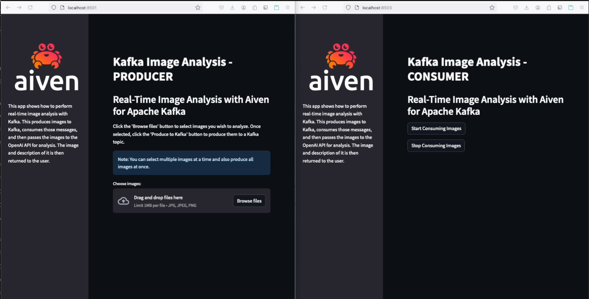
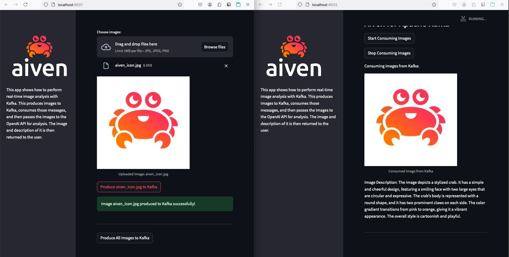

# Kafka Real-Time Image Analysis Application

This application allows users to upload images and produce them to a Kafka topic. The image will be processed by a consumer application that generates a description of the image using OpenAI. The consumer UI will then return to the user the image along with its description in real-time.

## Prerequisites

Before you can run the application, make sure you have the following installed and configured:

1. **Kafka**: You need to have a running Kafka cluster. You can follow the instructions on [Get started with Aiven for Apache Kafka](https://aiven.io/docs/products/kafka/get-started) for details on how to create a Kafka service on Aiven.
2. **Python 3.x**: The application is built and tested using Python 3.11, so ensure you have Python installed on your machine. We recommend using Python 3.11 as that's version tested for this application. 
3. **Required Python Packages**: The application requires the following Python packages:
    - `streamlit`
    - `kafka-python`
    - `Pillow`

   Install these using `pip`:

   ```bash
   pip install streamlit kafka-python pillow
   ```
4. **OpenAI API Key**: You need an OpenAI API key as the application will be using OpenAI to perform image descriptions. 

## Getting Started 
### Step 1: Aiven for Apache Kafka Setup

1. Ensure that you have [created a Kafka service on Aiven](https://aiven.io/docs/products/kafka/get-started)
2. Once the Kafka cluster is running, create a topic called `image-topic`. See the [create topic documentation](https://aiven.io/docs/products/kafka/howto/create-topic) for details on creating topics. 

### Step 2: Configure and Start the Streamlit Application 
1. Clone or download the application repo and navigate to the repo directory:
   ```bash
   git clone git@github.com:bruno-faria-aiven/kafka-demo-image-analysis.git
   cd kafka-demo-image-analysis
   ```
   > **Note:** Be sure to install the app requirements. To install the requirements using `pip`, run:

   ```bash
   pip install streamlit kafka-python pillow
   ```
2. Create a directory named `certs` (command: `mkdir certs`) and save/download your Kafka certificates to that directory. See the [connect-with-python docs](https://aiven.io/docs/products/kafka/howto/connect-with-python) for details on how to download the Kafka client certificate files. Once downloaded, the `certs` directory should contain the following three files:
   ```shell
   ca.pem		
   service.cert	
   service.key
   ```
   > **Note:** The certificate files should have the same name as the files above.
3. Before starting/running the application, you must modify the `config.py` file and set the following variables to your environment:

   ```shell
   KAFKA_HOST = '<Hostname for Kafka cluster>'
   KAFKA_SSL_PORT = '14863' # Only change this if you're using a different Kafka SSL port
   KAFKA_CERTS_PATH = 'certs' # Only change this if you're using a different certs path
   OPENAI_KEY = '<OPENAI API KEY>'
   ```
4. Start the Streamlit Producer and Consumer apps using the following command:
   ```shell
   ./start_app.sh start
   ```
   When the app is started with the `./start_app.sh start` script/command, if successful, the script will return an output similar to the following:
   ```shell
   $ ./start_app.sh start
   Starting Streamlit producer app...
   Streamlit producer started with PID 96869.
   Producer Local URL: http://localhost:8503
   Starting Streamlit consumer app...
   Streamlit consumer started with PID 96905.
   Consumer Local URL: http://localhost:8504
   ```
   When the app starts, it will also open two windows (one for producer app and the other for consumer app) in your default web browser.

### Step 3: Using the Application
1. Once the producer and consumer apps are running, it will open two windows (one for producer app and the other for consumer app) in your default web browser. If not, you can run the command `./start_app.sh status` to list the app URLs:

   ```shell
   $ ./start_app.sh status
   
   Streamlit producer is running with PID 96869.
   Producer Local URL: http://localhost:8503
   
   Streamlit consumer is running with PID 96905.
   Consumer Local URL: http://localhost:8504
   ```
    
   To make it easier for you to see the app in action, I recommend that you arrange the producer and consumer browser windows side by side. For example, the following image shows the producer (left) and consumer (right) windows running side by side:

   

   You will see the following features in the app:
   
   **Consumer app**
   - Start Consuming Button: Before uploading images, click the "Start Consuming Images" button to start consuming. While the app is consuming images, a "RUNNING..." status will be shown in the top right side of the consumer window. 
   - Stop Consuming Button: Once you're done consuming images, click the "Stop Consuming Images" button to stop consuming. 

   **Producer app**
   - File Uploader: Click on the "Choose images..." button to upload multiple images from your computer. 
   - Produce Button: After uploading images, click on the "Produce Image to Kafka" button for each image, or click the "Produce All Images to Kafka" button to send all uploaded images to the Kafka topic at once. 
   - Success Feedback: Once the image is produced to Kafka, you will see a success message.

2. Start consuming images

   Before you upload/produce images in the producer app, you must first click the "Start Consuming Images" button in the Consumer app UI to start consuming messages.

3. Start producing images
   
   Once you've started consuming images (previous step), you can upload and produce images to Kafka. Once images are written to Kafka, the consumer app will get the images and use OpenAI to generate a description of the image. The image along with its description is then shown to the user in the consumer window in real-time. The following screenshot shows an example where I produced an image of Aiven's icon (left window), and the consumer app returned the image and its description to the user in real-time (right window):

   